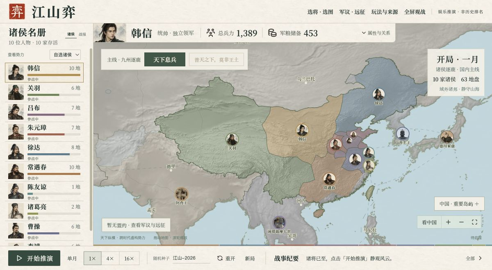

# 江山弈

[](https://github.com/Yuki9814/jiangshan-yi/actions/workflows/ci.yml)

一个以山河为棋盘的跨时代名将策略沙盘。使用 HTML、CSS、原生 JavaScript 与 SVG，在浏览器中本地推演，无需账号或在线模型。

项目仍在持续优化，欢迎提出玩法、地图表现、人物设定和使用体验方面的建议，也欢迎通过 Issue 和 Pull Request 一起改进。



## 目前可以玩什么

- **九州逐鹿**：主线聚焦中国诸侯争斗，世界底图支持拖动、缩放与全景查看。
- **天下息兵 / 再启烽烟**：随时决定休战或继续，无剩余势力数量限制。
- **普天之下，莫非王土**：息兵后自选开启域外副本，保留各家国内领土，允许多家诸侯共同达成终局。
- **人物与军议**：31 位人物、固定七维属性、雷达对照、关系事件、合纵结盟与远征。
- **选将选图**：可选 3–12 位主线人物，世界地图之外保留四张区域战场。
- **可复现推演**：随机种子、暂停、单月推进及 1× / 4× / 16× 速度。

## 本地运行

需要现代浏览器和 Python 3；游玩无需安装 Python 第三方包或 Node.js。

```sh
git clone https://github.com/Yuki9814/jiangshan-yi.git
cd jiangshan-yi
python3 launcher.py
```

macOS 也可双击 `打开江山弈.command`，优先使用 Google Chrome。Windows 可使用 `py -3 launcher.py`。保留启动器窗口，按 `Ctrl+C` 关闭本地服务。

不使用 Git 时，点击仓库的 **Code → Download ZIP**，解压后按上述方式启动。素材均随仓库提供；启动器只监听本机回环地址。

## 开发与贡献

这是一个无构建步骤的静态网页项目，修改源码后刷新浏览器即可查看。

| 文件 | 作用 |
| --- | --- |
| `index.html` / `styles.css` | 页面与纸墨风格 |
| `app.js` / `campaign-ui.js` | 操作、图鉴与篇章界面 |
| `engine.js` | 发展、战斗、关系、联盟及远征规则 |
| `map-view.js` | SVG 地图、视口和头像位置 |
| `character-data.js` / `world-characters.js` | 人物与固定属性 |
| `map-data.js` / `map-catalog.js` / `world-map.js` | 已生成的地图数据 |
| `source-tools/` | 地图生成与几何检查 |
| `assets/` | 地形、头像、字体和图标 |

[提交贡献](CONTRIBUTING.md) · [反馈问题](https://github.com/Yuki9814/jiangshan-yi/issues/new/choose) · [查看 PR](https://github.com/Yuki9814/jiangshan-yi/pulls)

本地机制检查需要 Node.js 22 或更新版本：

```sh
node engine.test.cjs
node character-mechanics.test.cjs
node campaign-mechanics.test.cjs
node world-mechanics.test.cjs
node world-completion.test.cjs
node viewport.test.cjs
```

地图几何检查需额外安装 `requirements.txt` 中的 Python 包，详见 [开发与检查](docs/DEVELOPMENT.md)。推送与 PR 会运行 GitHub Actions 自动检查。

## 地理、历史与素材

人物相遇、能力数值、虚构控制区和推演结局属于娱乐设定，不代表史学排名或人物真实疆域。世界底图采用公开地理数据，重要岛屿另有定位附图。自行制作的游戏地图尚未办理地图审核，不等同于官方标准地图。

[推演规则](RULES.md) · [人物与关系](CHARACTERS.md) · [世界人物](WORLD-CHARACTERS.md) · [历史来源](HISTORY.md) · [世界地图说明](WORLD-GEOGRAPHY.md) · [验收记录](docs/VALIDATION.md)

源码目前未指定统一开源许可证；公开可见及 GitHub Fork/PR 协作不等于一并授予商业再分发许可。字体、图标、历史图像和地理数据分别遵循其来源许可，见 [权利说明](RIGHTS.md) 与 [第三方素材](THIRD_PARTY_NOTICES.md)。
