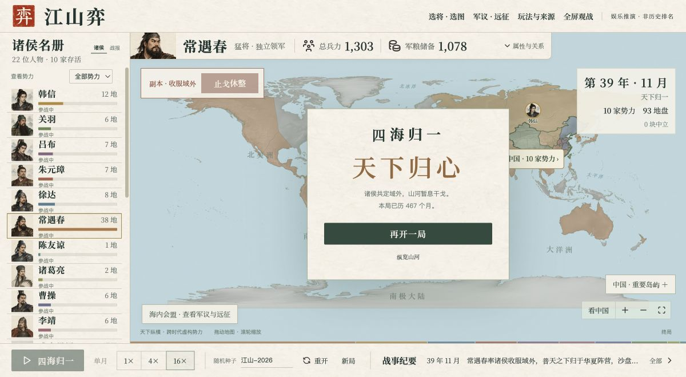

# 世界版验收记录

2026-09-12，本次公开源码来自已完成本地验证的世界版。仓库 Actions 展示的是当前提交的自动检查，以下为首次整理公开仓库时已有的浏览器实测记录。

- 世界地图 93 地块：中国区域 63、域外 30；191 条陆地邻接、17 条海路。
- 几何与全地块对边界复核通过；拉萨与日喀则的共享边界和邻接已补正。
- 主线息兵不限制剩余势力数；独立篇章契约检查 28 项通过。
- 三条自然推演路径：立即息兵后开启副本在第 467 月结束；第 60 月息兵后开启副本在第 466 月结束；第 484 月主线统一后开启副本在第 611 月结束。
- Chrome 实际操作默认十将开局，息兵后开启副本，第 467 月显示终局并自动停下；中国 63 地归属不变、十家诸侯全部保留，域外由韩信与常遇春共同持有。
- 视口自动检查覆盖五张地图、五种长宽比，共 125 个检查。
- 31 张人物头像、本地资源加载、重开与七维属性图鉴已检查。

上述月数是固定种子的样本，不是所有配置或种子的终止时间保证。本地浏览器主要使用 Google Chrome；Windows、手机及其他浏览器没有进行等量的交互验收。地图仍未办理正式审图。

